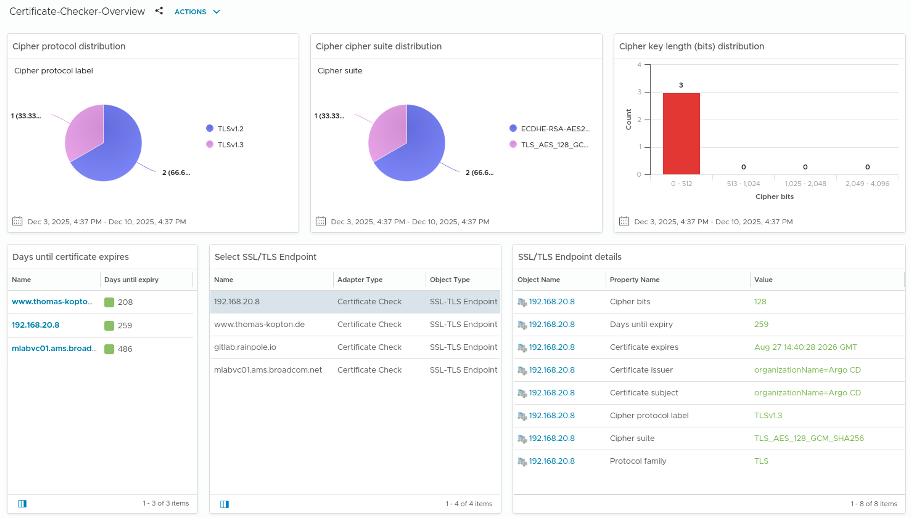

# SSL/TLS Certificate Checker Management Pack

The purpose of this Management Pack is to monitor SSL and TLS certificates for endpoints that are not included out-of-the-box in VCF Operations—primarily non-VCF components, meaning practically anything that secures a service with a certificate.

This Management Pack is designed as a modern and superior alternative to my old approach using Telegraf and scripts, as described in my blog: https://thomas-kopton.de/vblog/?p=538.

#### Collected Properties

* `protocol_family`: "SSL" or "TLS"
* `cipher_suite`: name of the negotiated cipher suite.
* `cipher_protocol_label`: protocol label (when available).
* `certificate_expires`: raw notAfter string from the certificate.
* `certificate_subject`: certificate subject (joined RDN pairs).
* `certificate_issuer`: certificate issuer (joined RDN pairs).

#### Collected Metrics

* `cypher_bits`: numeric cipher bit strength
* `remainig_days`: days until certificate expiry

#### Content
* Dashboards
    * Certificate-Checker-Overview
* Views
    * Certificate-Checker-DaysToExpire
    * Certificate-Checker-Protocols
    * Certificate-Checker-KeyLength
    * Certificate-Checker-Ciphers
* Reports
    * Certificate-Checker-Overview
* Alert Definitions
    *  Certificate-Checker-Cert-Expires

## Install

### Prerequisites
* VCF Operations 9.0.1 - tested
* VCF Operations 8.x - not tested but it should work
* Cloud Proxy: Integrations SDK Management Packs run on VCF Operations Cloud Proxies
* Cloud Proxy able to connect to container registry

For local registry, see: https://blogs.vmware.com/cloud-foundation/2025/09/02/transfer-vmware-cloud-foundation-operations-integration-sdk-builds-to-a-private-container-registry/

In general:
"The Management Packs generated by the VMware Aria Operations Integration SDK will only run on versions that support containerized Management Packs. Currently, this is limited to on-prem installs, version 8.10 or later. In addition, at least one Cloud Proxy (also version 8.10 or later) must be set up in VMware Aria Operations, as containerized Management Packs must be run on a Cloud Proxy collector."
https://vmware.github.io/vmware-aria-operations-integration-sdk/get_started/

### Installation Steps

1.  **Download the pak File from this repo: https://github.com/tkopton/certificatecheckermp/blob/main/CertificateCheck_1.0.0.pak**
    

2.  **Install dependencies:**

## Configure

To be done.
